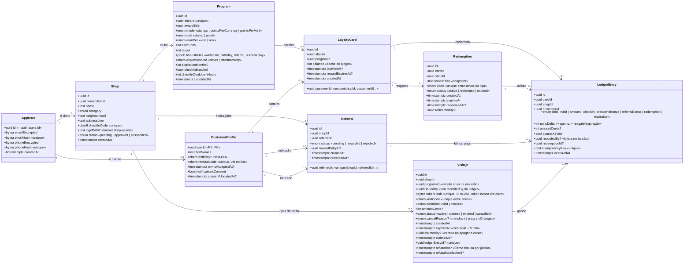

# Modelagem do banco de dados: MVP

Base: schemas Zod em `shared/schemas`, estado do mock (`layers/core/app/mock/state.ts`)
e `seed.example.ts`. Nomes em inglês, seguindo o glossário do `CLAUDE.md`.

## Stack

- **Banco:** Supabase (PostgreSQL).
- **Arquivos:** Supabase Storage (bucket).
- **Backend:** NestJS. Toda regra de negócio (antifraude, resgate, indicação) roda
  no Nest; o front nunca fala direto com o banco.
- **Autenticação:** Supabase Auth com **e-mail como validação** (código por e-mail,
  enviado pelo Resend como SMTP do Supabase). O Nest valida o JWT do Supabase.
  `AppUser.id` é o mesmo `auth.users.id`, então não existe tabela de código/OTP no
  nosso modelo.
- **Celular:** obrigatório no cadastro, guardado como dado pessoal, **sem
  verificação por SMS** no MVP. Serve para o Balcão achar o cliente.

## Fora do MVP

`Campaign` e `CampaignRecipient`, `Plan`, `Subscription` e `Invoice`, `NetworkAdmin`,
verificação de celular por SMS.

Consequências:
- Sem campanhas, o lembrete para "clientes sumidos" fica de fora. A lista de sumidos
  na tela Clientes continua, porque é só consulta.
- Sem plano e cobrança, o Fundador (R$ 79/mês) é combinado fora do sistema.
- Sem admin no sistema, a aprovação de loja (`Shop.status`) é feita direto no banco
  ou por script interno. **Ponto a confirmar.**

## Diagrama de classes

## Storage (bucket)

- Bucket `shop-assets`, leitura pública, escrita só pelo Nest (service role).
- Caminho: `shops/<shopId>/logo.<ext>`; `Shop.logoPath` guarda só o caminho, nunca a URL.
- Limites no Nest: imagens PNG/JPEG/WebP, até 2 MB.
- Nada pessoal vai para o bucket (sem foto de cliente).
- O MVP do front ainda não tem upload de logo; o campo e o bucket ficam prontos e
  podem entrar depois sem migration pesada.

## Indicação (referral)

1. O indicador abre o convite no app. O link leva o **código do indicador**
   (`CustomerProfile.referralCode`) e a **loja**: `/convite?ref=<referralCode>&loja=<checkInCode>`.
2. O indicado abre o link, confirma o e-mail, informa o celular e faz a primeira visita
   nessa loja. O app guarda `ref` e `loja` até a validação.
3. O app envia o convite (`POST /v1/referrals`) e o Nest o guarda como `Referral` `pending`. Na primeira
   visita (check-in ou balcão), depois de confirmada, o Nest paga: lança um `LedgerEntry` `referralBonus` no
   cartão do indicador (em transação própria) e marca `status = rewarded` (ou `rejected`, se a regra foi
   desligada). O bônus conta como atividade do cartão (`last_activity_at`), sem mexer em `last_visit_at`.

Regras no servidor:
- `Program.bonusRules.referralBonus.enabled` ligado.
- O indicado não pode já ter cartão ou visita nessa loja.
- Indicador ≠ indicado (e, por segurança, mesmo celular ou e-mail contam como a mesma pessoa).
- `unique(shopId, referredId)`: um cliente só é indicado uma vez por loja.
- Se o indicador ainda não tem cartão na loja, o cartão é criado com o bônus.
- Lançamento idempotente (`idempotencyKey = referral:<referralId>`).

O link usa o código opaco `referralCode`, não o `id` do cliente: id em URL vira dado
rastreável em log e histórico do navegador.

## Balcão e QR da visita

O Balcão **não recebe mais celular**. O ganho vem do QR da visita
([spec](./specs/dynamic-visit-qr/spec.md)): o lojista gera na venda (`visit_qrs`, uso único, 5 min, valor
preso no modo por real) e o cliente logado escaneia ou digita o código curto. O banco guarda só o
SHA-256 do token; o uso trava a linha do QR (`FOR UPDATE`) e o cartão (`LedgerStore`) e grava o ledger com
`kind = visit | amount`, `recordedBy = issuedBy` e chave `visit-qr:<id>` (segundo cadeado de uso único). O
QR da loja (`checkInCode`, cartaz) só cria o cartão zerado (entrar no clube), sem ledger. Busca por
`phoneHash` (`PiiService.hashPhone`, só os 11 dígitos) continua no login e na indicação.

Celular e e-mail são dados pessoais: cifrados em repouso, mascarados em listas, nunca
em log nem URL.

## Decisões de simplificação (a confirmar)

| Item | Como ficou no MVP | Alternativa |
|---|---|---|
| Prêmio | Coluna `Program.rewardTitle` (1 prêmio) | Tabela `Reward` |
| Regras bônus | `Program.bonusRules` em `jsonb`, validado pelo Zod | Tabela `ProgramBonusRule` |
| Dono da loja | `Shop.ownerUserId` | Tabela `ShopMember` (equipe) |
| QR da loja | `Shop.checkInCode` | Tabela `CheckInCode` (rotação) |
| Consentimento | Booleano e data em `CustomerProfile` | Tabela `ConsentEvent` (histórico) |
| Desafios do Descobrir | Fora; Descobrir lista só lojas aprovadas | `Challenge` + `ChallengeShop` |
| Aprovação de loja | Só `Shop.status` | `ShopStatusHistory` + `AuditLog` |

## Decisões que continuam valendo

1. **Ledger é a fonte da verdade.** `LedgerEntry` só recebe inserções, com
   `unitsDelta` assinado; `LoyaltyCard.balance` é cache atualizado na mesma
   transação. Não existe tabela `stamp`: as casas saem do ledger.
2. **Antifraude por consulta.** A janela de check-in vem da última linha com
   `countsAsVisit = true`; `lastVisitAt` evita a busca no caso comum. Decisão no
   servidor, em transação com lock no cartão.
3. **Idempotência.** `idempotencyKey` único: duplo clique ou retry não lança duas vezes.
4. **Resgate com snapshot** do título e índice único parcial
   `(shopId, code) WHERE status = 'active'`.
5. **IDs UUID v7**, com os brand types do Zod (`ShopId`, `CustomerId`…).

## Segurança no Supabase

- O Nest acessa o Postgres com credencial de servidor; o cliente do app nunca recebe
  a chave `service_role`.
- Mesmo assim, ligar **RLS em todas as tabelas, sem policy pública**: se alguma chave
  ou a API REST do Supabase vazar, nada é lido pelo `anon`.
- Migrations versionadas no repositório (ferramenta a definir com o time do Nest).

## Índices essenciais

- `AppUser(emailHash)` e `AppUser(phoneHash)` únicos; `CustomerProfile(referralCode)` único.
- `LoyaltyCard(shopId, customerId)` único; `(customerId)` para a carteira;
  `(shopId, lastVisitAt)` para clientes sumidos.
- `LedgerEntry(cardId, occurredAt DESC, id DESC)`, `(shopId, occurredAt DESC)`,
  `(customerId, occurredAt DESC, id DESC)` (caderneta do cliente; o `id` desempata o mesmo instante) e `(idempotencyKey)` único.
- `Redemption(shopId, code) WHERE status='active'` único e `(cardId) WHERE status='active'` único
  (um código ativo por cartão).
- `Referral(shopId, referredId)` único; `(referrerId)`.
- `Shop(checkInCode)` único; `Shop(status)`; `Shop(ownerUserId)`.
- `VisitQr(tokenHash)` único; `VisitQr(visitCode) WHERE status='active'` único (na rede toda);
  `(visitCode, createdAt DESC)`; `(shopId) WHERE status='active'`; `(ledgerEntryId)` único quando não nulo.

## Escala

- `LedgerEntry` é a tabela que cresce: particionar por mês quando passar de dezenas
  de milhões de linhas.
- Filtro por `shopId` obrigatório em toda consulta do lojista, aplicado no Nest.
